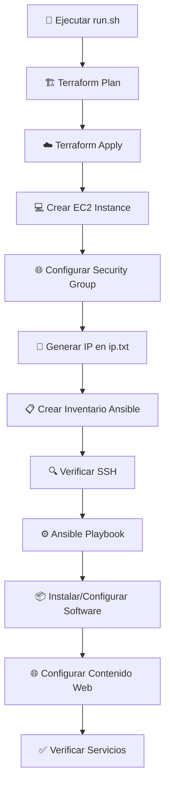

# Arquitectura Ansible Multi-Grupo

# Arquitectura Ansible Multi-Grupo

## 🔄 **Terraform vs Ansible: División de Responsabilidades**

### 🏗️ **Terraform - Provisión de Infraestructura**

**¿Qué hace Terraform?**

- **Crea la infraestructura física/virtual** en la nube
- **Gestiona el ciclo de vida** de recursos de infraestructura
- **Provisiona recursos** de manera declarativa
- **Mantiene el estado** de la infraestructura

#### 📋 **Responsabilidades específicas en nuestro lab:**

```hcl
# 1. PROVISIÓN DE INSTANCIAS EC2
resource "aws_instance" "web" {
  ami           = var.ami_id           # ✅ Selecciona la imagen del SO
  instance_type = var.instance_type    # ✅ Define el tamaño de la máquina
  key_name      = var.key_name         # ✅ Configura acceso SSH
}

# 2. CONFIGURACIÓN DE RED Y SEGURIDAD
resource "aws_security_group" "web_sg" {
  # ✅ Abre puertos (22 SSH, 80 HTTP)
  # ✅ Configura reglas de firewall a nivel de red
}

# 3. CONFIGURACIÓN BÁSICA DEL SISTEMA
user_data = <<-EOF
  #!/bin/bash
  yum update -y                    # ✅ Actualización inicial del sistema
  yum install -y httpd            # ✅ Instalación básica de Apache
  systemctl start httpd           # ✅ Inicio inicial del servicio
  systemctl enable httpd          # ✅ Habilitación del servicio
EOF
```

#### 🎯 **Terraform se encarga de:**

- ☁️ **Infraestructura como código** (Infrastructure as Code)
- 🌐 **Recursos de red** (VPC, Subnets, Security Groups)
- 💻 **Instancias de servidores** (EC2, VM, Compute Engine)
- 💾 **Almacenamiento** (EBS, S3, discos persistentes)
- 🔐 **IAM y permisos** a nivel de infraestructura
- 📊 **Outputs** (IPs, URLs, identificadores de recursos)

### ⚙️ **Ansible - Configuración y Gestión**

**¿Qué hace Ansible?**

- **Configura el software** dentro de los servidores ya creados
- **Gestiona aplicaciones** y servicios
- **Mantiene la configuración** deseada en el tiempo
- **Orquesta tareas** complejas entre múltiples servidores

#### 📋 **Responsabilidades específicas en nuestro lab:**

```yaml
# 1. CONFIGURACIÓN DETALLADA DE SERVICIOS
- name: Configurar Apache con templates personalizados
  template:
    src: httpd.conf.j2 # ✅ Configuración avanzada de Apache
    dest: /etc/httpd/conf/httpd.conf

# 2. GESTIÓN DE CONTENIDO WEB
- name: Crear página web personalizada
  template:
    src: index.html.j2 # ✅ Contenido web dinámico
    dest: /var/www/html/index.html

# 3. CONFIGURACIÓN DE FIREWALL INTERNO
- name: Configurar firewall detallado
  firewalld: # ✅ Reglas de firewall a nivel de OS
    service: "{{ item }}"
    permanent: yes

# 4. GESTIÓN DE USUARIOS Y PERMISOS
- name: Configurar permisos de archivos
  file:
    owner: apache # ✅ Propietarios y permisos específicos
    group: apache
    mode: "0644"
```

#### 🎯 **Ansible se encarga de:**

- 📦 **Gestión de paquetes** (yum, apt, chocolatey)
- ⚙️ **Configuración de servicios** (httpd, nginx, mysql)
- 🔧 **Files y templates** personalizados
- 👥 **Usuarios y grupos** del sistema
- 🔐 **Configuración de seguridad** detallada
- 📊 **Monitoreo y verificación** de servicios
- 🔄 **Actualizaciones** y mantenimiento continuo

## 🔄 **Flujo de Trabajo: Terraform → Ansible**



### 📊 **Tabla Comparativa de Responsabilidades**

| **Aspecto**      | **🏗️ Terraform**    | **⚙️ Ansible**                    |
| ---------------- | ------------------- | --------------------------------- |
| **Scope**        | Infraestructura     | Configuración                     |
| **Cuándo actúa** | Antes (provisión)   | Después (configuración)           |
| **Qué gestiona** | Recursos de nube    | Software y servicios              |
| **Ejemplos**     | EC2, S3, VPC, RDS   | Apache, MySQL, archivos, usuarios |
| **Estado**       | Terraform State     | Idempotencia                      |
| **Conectividad** | APIs de proveedores | SSH, WinRM                        |
| **Lenguaje**     | HCL (HashiCorp)     | YAML                              |

## 🎭 **Ejemplo Práctico del Flujo**

### 1️⃣ **Terraform ejecuta:**

```bash
# Crea infraestructura en AWS
terraform apply
```

**Resultado:**

- ✅ Instancia EC2 creada con IP `54.226.112.73`
- ✅ Security Group configurado (puertos 22, 80)
- ✅ Apache instalado básicamente
- ✅ Archivo [`ip.txt`](terraform-ansible-lab/ip.txt) generado

### 2️⃣ **Script de transición:**

```bash
# Genera inventario dinámico para Ansible
IP=$(cat ip.txt)
sed "s/{{ public_ip }}/$IP/" ansible/hosts.ini > ansible/hosts-ready.ini
```

**Resultado:**

```ini
[webservers]
54.226.112.73 ansible_user=ec2-user ansible_ssh_private_key_file=../demo-key.pem
```

### 3️⃣ **Ansible ejecuta:**

```bash
# Configura y personaliza el servidor
ansible-playbook -i ansible/hosts-ready.ini ansible/playbook.yml
```

**Resultado:**

- ✅ Sistema actualizado completamente
- ✅ Apache configurado con templates personalizados
- ✅ Página web personalizada creada
- ✅ Firewall configurado detalladamente
- ✅ Verificaciones automáticas realizadas

## 🤝 **¿Por qué usar ambos juntos?**

### **🏗️ Terraform es mejor para:**

- 🚀 **Velocidad de provisión** - Crea recursos rápidamente
- 🔄 **Gestión de estado** - Sabe qué existe y qué no
- ☁️ **Multi-cloud** - Funciona con AWS, Azure, GCP
- 📊 **Planificación** - Muestra qué va a cambiar antes de aplicar

### **⚙️ Ansible es mejor para:**

- 🎯 **Precisión de configuración** - Control granular sobre servicios
- 📦 **Gestión de software** - Instalación y configuración de aplicaciones
- 🔄 **Mantenimiento continuo** - Actualiza configuraciones existentes
- 👥 **Gestión de múltiples hosts** - Orquesta cambios en grupos de servidores

## 🎯 **Analogía del Mundo Real**

```
🏗️ TERRAFORM = CONSTRUCTOR DE CASAS
   │
   ├── Construye la estructura (EC2, redes)
   ├── Instala servicios básicos (electricidad, agua)
   └── Entrega las llaves (SSH keys, IPs)

⚙️ ANSIBLE = DECORADOR DE INTERIORES
   │
   ├── Configura los muebles (Apache, MySQL)
   ├── Personaliza la decoración (páginas web, configs)
   ├── Instala electrodomésticos (servicios adicionales)
   └── Mantiene todo funcionando (actualizaciones, monitoreo)
```

## 🚀 **Ejecución con run.sh**

Nuestro script [`run.sh`](terraform-ansible-lab/run.sh) orquesta ambas herramientas:

1. **🏗️ FASE TERRAFORM** (líneas 8-26)

   - Limpia estado anterior
   - Inicializa providers
   - Aplica configuración
   - Espera que la instancia esté lista

2. **🔄 FASE TRANSICIÓN** (líneas 28-35)

   - Lee IP generada por Terraform
   - Crea inventario dinámico para Ansible
   - Verifica conectividad SSH

3. **⚙️ FASE ANSIBLE** (líneas 37-40)
   - Ejecuta playbook completo
   - Configura servicios detalladamente
   - Verifica que todo funcione

¡Esta separación de responsabilidades hace que tu infraestructura sea más mantenible, escalable y robusta! 🎉

## 🏗️ Arquitectura del Sistema

```
                        +-----------------------+
                        | Ansible Management    |
                        |        Node           |
                        +----------+------------+
                                   |
                   +---------------+-----------------+
                   |                                 |
             +-----v-----+                     +-----v-----+
             | Playbook  |                     | Inventory |
             +-----------+                     +-----------+
                  |                                  |
                  |                                  v
                  |                        ┌─────────────────┐
                  |                        │  GRUPO A        │
                  |                        │  [webservers]   │
                  |                        │  • web1         │
                  |                        │  • web2         │
                  |                        │  • web3         │
                  |                        └─────────────────┘
                  |                                  |
                  |                        ┌─────────────────┐
                  |                        │  GRUPO B        │
                  |                        │  [dbservers]    │
                  |                        │  • db1          │
                  |                        │  • db2          │
                  |                        └─────────────────┘
                  |                                  |
                  |                        ┌─────────────────┐
                  |                        │  GRUPO C        │
                  |                        │ [loadbalancers] │
                  |                        │  • lb1          │
                  |                        │  • lb2          │
                  |                        └─────────────────┘
                  |                                  |
                  +----------------------------------+
                                   |
                    +--------------+--------------+
                    |              |              |
                 SSH             SSH            SSH
                    |              |              |
               +----v----+     +----v----+     +----v----+
               | Host 1  |     | Host 2  |     | Host N  |
               |(grupo A)|     |(grupo B)|     |(grupo C)|
               +---------+     +---------+     +---------+
```

## 📁 Estructura de Archivos

```
ansible/
├── inventory.ini              # Inventario principal multi-grupo
├── hosts-ready.ini           # Inventario dinámico generado por Terraform
├── playbook.yml              # Playbook principal actualizado
├── templates/                # Templates Jinja2
│   ├── index.html.j2        # Página web personalizada
│   ├── info.html.j2         # Página de información del sistema
│   ├── httpd.conf.j2        # Configuración de Apache
│   └── nginx.conf.j2        # Configuración de Nginx Load Balancer
└── group_vars/               # Variables por grupos (opcional)
    ├── webservers.yml
    ├── dbservers.yml
    └── loadbalancers.yml
```

## 🎯 Grupos de Servidores

### GRUPO A: Servidores Web ([webservers])

**Función:** Frontend, servidores de aplicación

- **Servicios:** Apache HTTP, Nginx
- **Puertos:** 80 (HTTP), 443 (HTTPS)
- **Variables específicas:**
  - `apache_service=httpd`
  - `web_root=/var/www/html`
  - `server_role=frontend`

### GRUPO B: Servidores de Base de Datos ([dbservers])

**Función:** Backend, almacenamiento de datos

- **Servicios:** MariaDB, MySQL, PostgreSQL
- **Puertos:** 3306 (MySQL), 5432 (PostgreSQL)
- **Variables específicas:**
  - `mysql_port=3306`
  - `server_role=database`

### GRUPO C: Balanceadores de Carga ([loadbalancers])

**Función:** Distribución de tráfico, alta disponibilidad

- **Servicios:** Nginx, HAProxy
- **Puertos:** 80 (HTTP), 443 (HTTPS)
- **Variables específicas:**
  - `nginx_port=80`
  - `backend_servers=web1,web2,web3`
  - `server_role=loadbalancer`

## 🔧 Playbook Mejorado

### Nuevas Características:

1. **📦 Actualización del sistema** - Mantiene servidores actualizados
2. **🔥 Configuración de firewall** - Seguridad de puertos
3. **📄 Templates dinámicos** - Configuraciones personalizadas
4. **🔍 Verificaciones automáticas** - Health checks
5. **📊 Información detallada** - Página de información del sistema
6. **🏷️ Tags organizados** - Ejecución selectiva de tareas
7. **🔄 Handlers inteligentes** - Reinicio de servicios cuando sea necesario

### Comandos de Ejecución:

#### Ejecutar todo el playbook:

```bash
ansible-playbook -i ansible/inventory.ini ansible/playbook.yml
```

#### Ejecutar solo tareas específicas:

```bash
# Solo actualizaciones del sistema
ansible-playbook -i ansible/inventory.ini ansible/playbook.yml --tags="system"

# Solo configuración web
ansible-playbook -i ansible/inventory.ini ansible/playbook.yml --tags="webserver"

# Solo verificaciones
ansible-playbook -i ansible/inventory.ini ansible/playbook.yml --tags="verify"
```

#### Ejecutar en grupos específicos:

```bash
# Solo servidores web
ansible-playbook -i ansible/inventory.ini ansible/playbook.yml --limit="webservers"

# Solo bases de datos
ansible-playbook -i ansible/inventory.ini ansible/playbook.yml --limit="dbservers"

# Solo balanceadores
ansible-playbook -i ansible/inventory.ini ansible/playbook.yml --limit="loadbalancers"
```

## 🌐 Variables por Grupo

### Variables Globales ([all:vars])

```yaml
ansible_ssh_common_args: "-o StrictHostKeyChecking=no"
ansible_python_interpreter: /usr/bin/python3
environment: production
project: terraform-ansible-lab
```

### Variables de Webservers ([webservers:vars])

```yaml
apache_service: httpd
web_root: /var/www/html
server_role: frontend
```

### Variables de DB Servers ([dbservers:vars])

```yaml
mysql_root_password: SecurePass123!
mysql_port: 3306
server_role: database
```

### Variables de Load Balancers ([loadbalancers:vars])

```yaml
nginx_port: 80
backend_servers: web1.example.com,web2.example.com
server_role: loadbalancer
```

## 🎭 Meta-Grupos (Grupos de Grupos)

### [production:children]

Agrupa todos los servidores de producción:

- webservers
- dbservers
- loadbalancers

### [frontend:children]

Servidores que manejan tráfico público:

- webservers
- loadbalancers

### [backend:children]

Servidores internos:

- dbservers

## 🚀 Ejecución con run.sh

El script actualizado ahora:

1. 🧹 **Limpia** el estado anterior
2. 🔧 **Configura** timeouts y variables
3. 📦 **Inicializa** Terraform
4. 🔑 **Configura** permisos de plugins
5. 📋 **Muestra** el plan de ejecución
6. ✅ **Aplica** la infraestructura
7. ⏳ **Espera** que la instancia esté lista
8. 🎯 **Genera** inventario dinámico
9. 🔍 **Verifica** conectividad SSH
10. 🚀 **Ejecuta** el playbook de Ansible
11. 📊 **Muestra** información de resultado

## 📋 Comandos Útiles

### Verificar conectividad:

```bash
ansible -i ansible/hosts-ready.ini all -m ping
```

### Obtener información del sistema:

```bash
ansible -i ansible/hosts-ready.ini all -m setup
```

### Ejecutar comandos ad-hoc:

```bash
ansible -i ansible/hosts-ready.ini webservers -m shell -a "systemctl status httpd"
```

### Ver información de grupos:

```bash
ansible-inventory -i ansible/inventory.ini --list
```

## 🔐 Seguridad

- ✅ **SSH Keys** - Autenticación sin contraseñas
- ✅ **StrictHostKeyChecking** - Deshabilitado para lab
- ✅ **Firewall** - Configurado automáticamente
- ✅ **Service Users** - Servicios con usuarios específicos
- ✅ **File Permissions** - Permisos adecuados para archivos web

## 🎯 Beneficios de esta Arquitectura

1. **🏗️ Escalabilidad** - Fácil agregar nuevos hosts
2. **🎛️ Flexibilidad** - Configuraciones específicas por grupo
3. **🔧 Mantenibilidad** - Código organizado y reutilizable
4. **🚀 Automatización** - Script completo de despliegue
5. **📊 Visibilidad** - Información detallada del sistema
6. **🔍 Debugging** - Tags y límites para ejecución selectiva

¡Esta arquitectura te permite gestionar infraestructuras complejas de manera eficiente y organizada! 🎉
